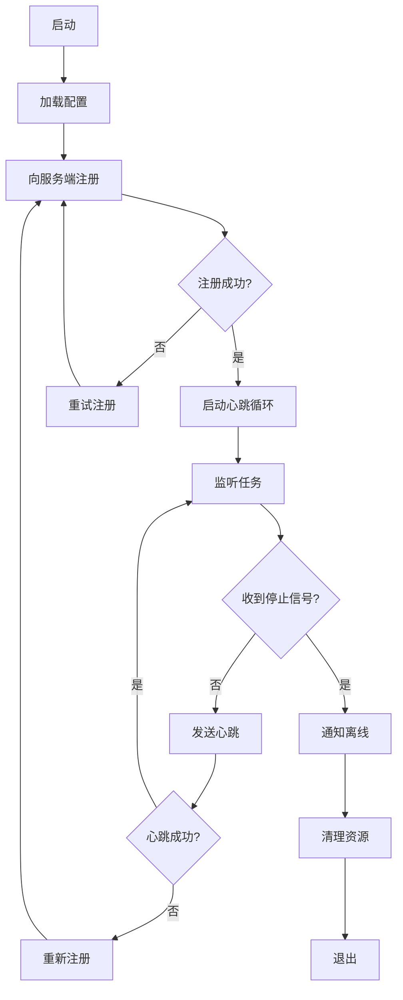
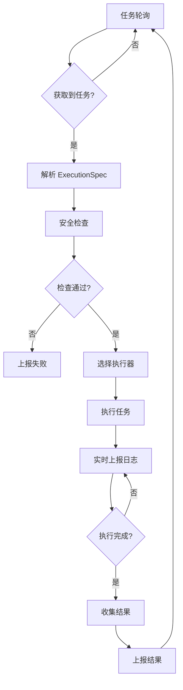
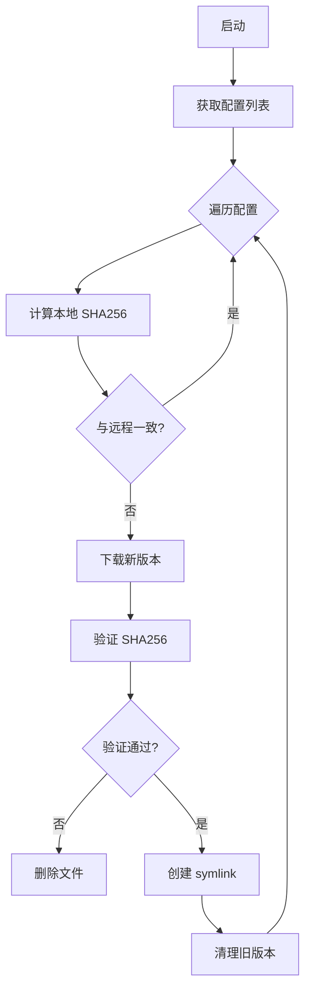

# TestNet 客户端架构设计


---

## 一、架构概览

TestNet 客户端是基于 Go 构建的轻量级分布式扫描节点，负责执行服务端下发的扫描任务并上报结果。

### 1.1 设计目标

- **轻量级**: 单一二进制文件，无外部依赖，快速部署
- **跨平台**: 支持 Linux、macOS、Windows
- **安全隔离**: 多层安全防护，防止滥用和攻击
- **高可用**: 自动重连、重试机制、状态恢复
- **可扩展**: 支持多种执行器类型，易于扩展

### 1.2 核心架构

```
┌─────────────────────────────────────────────────────────────┐
│                     TestNet Client                          │
├─────────────────────────────────────────────────────────────┤
│  ┌─────────────┐  ┌─────────────┐  ┌─────────────┐         │
│  │    node/    │  │    task/    │  │  configfile/│         │
│  │  生命周期    │  │  任务执行    │  │  配置同步    │         │
│  └──────┬──────┘  └──────┬──────┘  └──────┬──────┘         │
│         │                │                │                 │
│  ┌──────▼────────────────▼────────────────▼──────┐         │
│  │              security/ (安全策略)               │         │
│  └───────────────────────────────────────────────┘         │
│         │                                                   │
│  ┌──────▼──────┐  ┌─────────────┐  ┌─────────────┐         │
│  │    dsl/     │  │   config/   │  │   logger/   │         │
│  │  DSL模型    │  │   配置管理   │  │    日志     │         │
│  └─────────────┘  └─────────────┘  └─────────────┘         │
└─────────────────────────────────────────────────────────────┘
                              │
                              ▼
              ┌─────────────────────────────┐
              │     External Executors      │
              ├─────────────────────────────┤
              │ Docker │ Shell │ HTTP │ DNS │ TCP │
              └─────────────────────────────┘
```

---

## 二、核心模块详解

### 2.1 节点生命周期 (node/)

节点生命周期模块负责客户端的注册、心跳、离线管理。

#### 目录结构

```
internal/node/
├── node.go          # 核心逻辑
├── node_test.go     # 单元测试
└── doc.go           # 包文档
```

#### 核心流程



#### 关键实现

**注册**：
```go
func (n *Node) Register(ctx context.Context) error {
    req := &RegisterRequest{
        Name:       n.config.Name,
        Labels:     n.config.Labels,
        SystemInfo: n.getSystemInfo(),
    }
    resp, err := n.client.Register(ctx, req)
    if err != nil {
        return err
    }
    n.id = resp.ClientId
    n.token = resp.Token
    return nil
}
```

**心跳**：
```go
func (n *Node) Heartbeat(ctx context.Context) error {
    req := &HeartbeatRequest{
        ClientId:    n.id,
        Status:      n.getStatus(),
        TaskCount:   n.taskManager.GetActiveCount(),
        SystemStats: n.getSystemStats(),
    }
    return n.client.Heartbeat(ctx, req)
}
```

**离线**：
```go
func (n *Node) Offline(ctx context.Context) error {
    req := &OfflineRequest{ClientId: n.id}
    return n.client.Offline(ctx, req)
}
```

#### 重连机制

- 注册失败：指数退避重试（1s, 2s, 4s, ...最大 30s）
- 心跳失败：连续 3 次失败后重新注册
- 网络中断：自动检测并重连

---

### 2.2 任务执行引擎 (task/)

任务执行引擎是客户端的核心模块，负责任务轮询、执行、结果上报。

#### 目录结构

```
internal/task/
├── task.go                    # TaskManager 核心
├── executor.go                # 执行器路由
├── docker_executor.go         # Docker 执行器
├── http_executor.go           # HTTP 执行器
├── dns_executor.go            # DNS 执行器
├── tcp_executor.go            # TCP 执行器
├── execution_spec_adapter.go  # ExecutionSpec 适配
├── callback.go                # 任务回调
└── *_test.go                  # 测试文件
```

#### 核心流程



#### TaskManager

```go
type TaskManager struct {
    client       *APIClient
    config       *Config
    executor     *Executor
    activeTasks  map[string]*Task
    semaphore    chan struct{}  // 并发控制
    logger       *zap.Logger
}

func (tm *TaskManager) Poll(ctx context.Context) error {
    for {
        select {
        case <-ctx.Done():
            return ctx.Err()
        default:
            task, err := tm.client.PollTask(ctx, tm.clientID)
            if err != nil {
                tm.logger.Error("poll task failed", zap.Error(err))
                time.Sleep(tm.config.PollInterval)
                continue
            }
            if task != nil {
                go tm.executeTask(ctx, task)
            }
        }
    }
}
```

#### 执行器路由

```go
func (e *Executor) Execute(ctx context.Context, spec *ExecutionSpec) (*Result, error) {
    switch spec.ExecType {
    case "DOCKER":
        return e.dockerExecutor.Execute(ctx, spec)
    case "HTTP":
        return e.httpExecutor.Execute(ctx, spec)
    case "DNS":
        return e.dnsExecutor.Execute(ctx, spec)
    case "TCP":
        return e.tcpExecutor.Execute(ctx, spec)
    case "SHELL":
        return e.shellExecutor.Execute(ctx, spec)
    default:
        return nil, fmt.Errorf("unknown executor type: %s", spec.ExecType)
    }
}
```

---

### 2.3 Docker 执行器

Docker 执行器是最常用的执行器，支持容器化的安全工具执行。

#### 容器生命周期


#### 关键实现

```go
func (e *DockerExecutor) Execute(ctx context.Context, spec *ExecutionSpec) (*Result, error) {
    // 1. 安全检查
    if err := e.security.ValidateDockerConfig(spec.DockerConfig); err != nil {
        return nil, err
    }

    // 2. 拉取镜像
    if err := e.pullImage(ctx, spec.DockerImage); err != nil {
        return nil, err
    }

    // 3. 创建容器
    containerID, err := e.createContainer(ctx, spec)
    if err != nil {
        return nil, err
    }
    defer e.removeContainer(ctx, containerID)

    // 4. 启动容器
    if err := e.client.ContainerStart(ctx, containerID, types.ContainerStartOptions{}); err != nil {
        return nil, err
    }

    // 5. 等待完成
    statusCh, errCh := e.client.ContainerWait(ctx, containerID, container.WaitConditionNotRunning)
    select {
    case err := <-errCh:
        return nil, err
    case status := <-statusCh:
        // 6. 收集日志
        logs, _ := e.collectLogs(ctx, containerID)
        return &Result{
            ExitCode: status.StatusCode,
            Output:   logs,
        }, nil
    case <-ctx.Done():
        e.client.ContainerKill(ctx, containerID, "SIGTERM")
        return nil, ctx.Err()
    }
}
```

#### Podman 兼容

Docker 执行器同时支持 Podman，自动检测 Docker socket 或 Podman socket：

```go
func getDockerHost() string {
    dockerSocket := "/var/run/docker.sock"
    podmanSocket := "/run/podman/podman.sock"
    
    if _, err := os.Stat(dockerSocket); err == nil {
        return "unix://" + dockerSocket
    }
    if _, err := os.Stat(podmanSocket); err == nil {
        return "unix://" + podmanSocket
    }
    return ""
}
```

---

### 2.4 HTTP 执行器

HTTP 执行器用于执行 HTTP 请求，支持自定义方法、头部、超时等配置。

#### SSRF 防护

```go
func (e *HTTPExecutor) Execute(ctx context.Context, spec *ExecutionSpec) (*Result, error) {
    // 解析 URL
    u, err := url.Parse(spec.HTTPConfig.URL)
    if err != nil {
        return nil, err
    }

    // SSRF 检查
    if e.security.IsBlockedHost(u.Hostname()) {
        return nil, fmt.Errorf("SSRF blocked: %s", u.Hostname())
    }

    // DNS 解析后再次检查 IP
    ips, _ := net.LookupIP(u.Hostname())
    for _, ip := range ips {
        if e.security.IsBlockedIP(ip) {
            return nil, fmt.Errorf("SSRF blocked IP: %s", ip)
        }
    }

    // 执行请求
    req, _ := http.NewRequestWithContext(ctx, spec.HTTPConfig.Method, spec.HTTPConfig.URL, nil)
    for k, v := range spec.HTTPConfig.Headers {
        req.Header.Set(k, v)
    }
    
    resp, err := e.client.Do(req)
    if err != nil {
        return nil, err
    }
    defer resp.Body.Close()

    body, _ := io.ReadAll(resp.Body)
    return &Result{
        ExitCode: 0,
        Output:   string(body),
        Metadata: map[string]interface{}{
            "status_code": resp.StatusCode,
            "headers":     resp.Header,
        },
    }, nil
}
```

---

### 2.5 DNS 执行器

DNS 执行器用于执行 DNS 查询，支持多种记录类型。

```go
func (e *DNSExecutor) Execute(ctx context.Context, spec *ExecutionSpec) (*Result, error) {
    // SSRF 检查
    if e.security.IsBlockedDomain(spec.DNSConfig.Domain) {
        return nil, fmt.Errorf("blocked domain: %s", spec.DNSConfig.Domain)
    }

    // 创建 DNS 客户端
    client := &dns.Client{
        Timeout: time.Duration(spec.TimeoutSeconds) * time.Second,
    }

    // 构建查询
    msg := new(dns.Msg)
    msg.SetQuestion(dns.Fqdn(spec.DNSConfig.Domain), dns.StringToType[spec.DNSConfig.RecordType])

    // 发送查询
    nameserver := spec.DNSConfig.Nameserver
    if nameserver == "" {
        nameserver = "8.8.8.8:53"
    }
    
    resp, _, err := client.Exchange(msg, nameserver)
    if err != nil {
        return nil, err
    }

    // 解析结果
    var records []string
    for _, ans := range resp.Answer {
        records = append(records, ans.String())
    }

    return &Result{
        ExitCode: 0,
        Output:   strings.Join(records, "\n"),
    }, nil
}
```

---

### 2.6 TCP 执行器

TCP 执行器用于端口扫描和 Banner 抓取。

```go
func (e *TCPExecutor) Execute(ctx context.Context, spec *ExecutionSpec) (*Result, error) {
    address := fmt.Sprintf("%s:%d", spec.TCPConfig.Host, spec.TCPConfig.Port)

    // 建立 TCP 连接
    conn, err := net.DialTimeout("tcp", address, time.Duration(spec.TimeoutSeconds)*time.Second)
    if err != nil {
        return &Result{
            ExitCode: 1,
            Output:   err.Error(),
        }, nil
    }
    defer conn.Close()

    // Banner 抓取
    var banner string
    if spec.TCPConfig.BannerGrab {
        conn.SetReadDeadline(time.Now().Add(time.Duration(spec.TCPConfig.BannerTimeout) * time.Second))
        buf := make([]byte, 1024)
        n, _ := conn.Read(buf)
        banner = string(buf[:n])
    }

    return &Result{
        ExitCode: 0,
        Output:   banner,
        Metadata: map[string]interface{}{
            "address": address,
            "banner":  banner,
        },
    }, nil
}
```

---

### 2.7 安全策略 (security/)

安全策略模块提供多层防护机制。

#### 二进制白名单

```go
var AllowedBinaries = map[string]bool{
    "docker":      true,
    "nmap":        true,
    "masscan":     true,
    "nuclei":      true,
    "subfinder":   true,
    "httpx":       true,
    // ... 80+ 白名单二进制
}

func (p *Policy) ValidateBinary(binary string) error {
    base := filepath.Base(binary)
    if !AllowedBinaries[base] {
        return fmt.Errorf("binary not in whitelist: %s", base)
    }
    return nil
}
```

#### SSRF 防护

```go
var BlockedIPRanges = []string{
    "10.0.0.0/8",
    "172.16.0.0/12",
    "192.168.0.0/16",
    "127.0.0.0/8",
    "169.254.0.0/16",
    "0.0.0.0/8",
}

func (p *Policy) IsBlockedIP(ip net.IP) bool {
    for _, cidr := range BlockedIPRanges {
        _, network, _ := net.ParseCIDR(cidr)
        if network.Contains(ip) {
            return true
        }
    }
    return false
}

func (p *Policy) IsBlockedHost(host string) bool {
    blocked := []string{"localhost", "127.0.0.1", "0.0.0.0", "::1"}
    for _, b := range blocked {
        if host == b {
            return true
        }
    }
    return false
}
```

#### 卷挂载限制

```go
var AllowedMountPaths = []string{
    "/tmp",
    "/var/tmp",
}

var MaxVolumeSize int64 = 100 * 1024 * 1024 // 100MB

func (p *Policy) ValidateVolume(hostPath string) error {
    // 路径检查
    allowed := false
    for _, prefix := range AllowedMountPaths {
        if strings.HasPrefix(hostPath, prefix) {
            allowed = true
            break
        }
    }
    if !allowed {
        return fmt.Errorf("volume path not allowed: %s", hostPath)
    }

    // 大小检查
    var stat syscall.Statfs_t
    if err := syscall.Statfs(hostPath, &stat); err == nil {
        available := stat.Bavail * uint64(stat.Bsize)
        if available > uint64(MaxVolumeSize) {
            return fmt.Errorf("volume size exceeds limit: %s", hostPath)
        }
    }

    return nil
}
```

---

### 2.8 配置文件同步 (configfile/)

配置文件同步模块负责远程配置文件的同步和版本管理。

#### 同步流程



#### 版本管理

使用 symlink 管理配置文件版本：

```
/var/lib/testnet/configs/
├── subfinder/
│   ├── config.yaml.v1
│   ├── config.yaml.v2
│   └── config.yaml -> config.yaml.v2
```

```go
func (m *Manager) updateSymlink(configID, version string) error {
    dir := m.getConfigDir(configID)
    target := filepath.Join(dir, fmt.Sprintf("%s.v%s", m.filename, version))
    link := filepath.Join(dir, m.filename)

    // 原子性更新 symlink
    tempLink := link + ".tmp"
    if err := os.Symlink(target, tempLink); err != nil {
        return err
    }
    return os.Rename(tempLink, link)
}
```

---

## 三、数据模型

### 3.1 ExecutionSpec

ExecutionSpec 是服务端下发给客户端的执行规范。

```go
type ExecutionSpec struct {
    ExecType        string                 `json:"execType"`
    DockerImage     string                 `json:"dockerImage,omitempty"`
    Command         string                 `json:"command,omitempty"`
    Args            []string               `json:"args,omitempty"`
    Timeout         int                    `json:"timeout"`
    WorkDir         string                 `json:"workDir,omitempty"`
    Env             map[string]string      `json:"env,omitempty"`
    DockerConfig    *DockerConfig          `json:"dockerConfig,omitempty"`
    HTTPConfig      *HTTPConfig            `json:"httpConfig,omitempty"`
    DNSConfig       *DNSConfig             `json:"dnsConfig,omitempty"`
    TCPConfig       *TCPConfig             `json:"tcpConfig,omitempty"`
    Files           []FileSpec             `json:"files,omitempty"`
    CleanupFiles    []string               `json:"cleanupFiles,omitempty"`
    ConfigFiles     []ConfigFileUsage      `json:"configFiles,omitempty"`
    InputAssetType  string                 `json:"inputAssetType,omitempty"`
    OutputAssetType string                 `json:"outputAssetType,omitempty"`
    SourceAssetID   string                 `json:"sourceAssetId,omitempty"`
}
```

### 3.2 任务状态

```go
type TaskStatus string

const (
    TaskStatusPending   TaskStatus = "PENDING"
    TaskStatusAssigned  TaskStatus = "ASSIGNED"
    TaskStatusRunning   TaskStatus = "RUNNING"
    TaskStatusCompleted TaskStatus = "COMPLETED"
    TaskStatusFailed    TaskStatus = "FAILED"
)
```

---

## 四、性能优化

### 4.1 并发控制

使用信号量控制最大并发任务数：

```go
type TaskManager struct {
    semaphore chan struct{}
}

func (tm *TaskManager) executeTask(ctx context.Context, task *Task) {
    // 获取信号量
    tm.semaphore <- struct{}{}
    defer func() { <-tm.semaphore }()

    // 执行任务
    result, err := tm.executor.Execute(ctx, task.ExecutionSpec)
    // ...
}
```

### 4.2 长轮询

任务轮询使用 HTTP 长轮询机制，减少网络开销。当前 Go 客户端不依赖 WebSocket 拉取任务；服务端 WebSocket 主要用于前端通知和任务状态展示。

```go
func (c *APIClient) PollTask(ctx context.Context, clientID string) (*Task, error) {
    req := &PollRequest{
        ClientId:  clientID,
        Timeout:   30, // 30 秒长轮询
    }
    return c.pollTaskWithRetry(ctx, req, 3)
}
```

### 4.3 日志批量上报

任务日志采用批量上报策略：

```go
type LogBuffer struct {
    buffer   []LogEntry
    maxItems int
    maxWait  time.Duration
    client   *APIClient
}

func (lb *LogBuffer) Add(entry LogEntry) {
    lb.buffer = append(lb.buffer, entry)
    if len(lb.buffer) >= lb.maxItems {
        lb.Flush()
    }
}

func (lb *LogBuffer) Flush() error {
    if len(lb.buffer) == 0 {
        return nil
    }
    err := lb.client.UploadLogs(lb.buffer)
    lb.buffer = lb.buffer[:0]
    return err
}
```

---

## 五、监控与调试

### 5.1 健康检查

客户端提供健康检查端点（可选）：

```go
func (n *Node) HealthCheck() map[string]interface{} {
    return map[string]interface{}{
        "status":       "healthy",
        "node_id":      n.id,
        "active_tasks": n.taskManager.GetActiveCount(),
        "uptime":       time.Since(n.startTime).Seconds(),
        "system":       n.getSystemStats(),
    }
}
```

### 5.2 日志级别

支持动态调整日志级别：

```go
func SetLogLevel(level string) {
    var zapLevel zapcore.Level
    switch level {
    case "debug":
        zapLevel = zapcore.DebugLevel
    case "info":
        zapLevel = zapcore.InfoLevel
    case "warn":
        zapLevel = zapcore.WarnLevel
    case "error":
        zapLevel = zapcore.ErrorLevel
    }
    logger.SetLevel(zapLevel)
}
```

### 5.3 性能指标

关键性能指标：
- 任务执行成功率
- 平均执行时间
- 并发任务数
- 内存使用量
- CPU 使用率

---

## 六、故障排查

### 6.1 常见问题

| 问题 | 可能原因 | 解决方法 |
|------|----------|----------|
| 无法连接服务端 | 网络问题、密钥错误 | 检查网络、验证密钥 |
| Docker 任务失败 | 镜像不存在、权限问题 | 拉取镜像、检查权限 |
| 任务超时 | 网络慢、目标不可达 | 增加超时时间 |
| SSRF 拦截 | 访问内网地址 | 检查目标地址合法性 |

### 6.2 调试命令

```bash
# 查看日志
./testnet-client -verbose

# 测试执行
./testnet-client test --spec spec.yaml --mock mock.yaml

# 验证 DSL
./testnet-client validate --spec spec.yaml

# 查看机器码
./testnet-license show-machine-id
```

---

## 相关文档

- [扫描节点管理](/client/overview) - 节点部署和管理
- [系统部署与激活指南](/deploy/overview) - 完整服务配置与集群扩展说明
- [DSL 规范参考](/workflow/dsl-reference) - vNext DSL 详细说明
