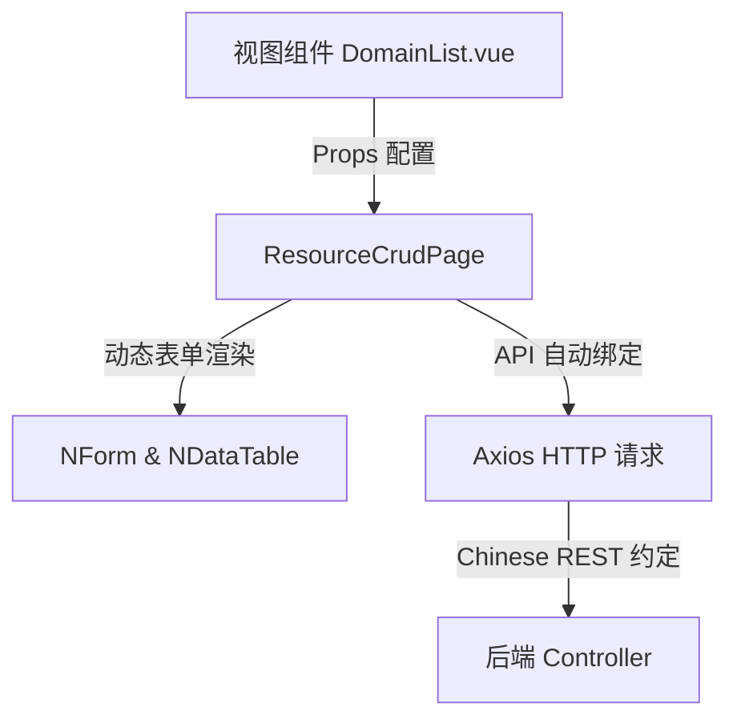

# 前端通用 CRUD 页面骨架开发指南

`ResourceCrudPage.vue`（位于 `src/components/ResourceCrudPage.vue`）是 TestNet 前端项目的核心复用组件。整个系统中的 8 种资产管理模块以及项目管理、角色权限、用户配置等十几个页面，均基于该组件搭建。它提供了标准化的数据列表、表单录入、分页筛选、Excel 导入导出、自定义列和批量操作功能。

## 核心设计原理

`ResourceCrudPage` 遵循 **声明式配置驱动** 与 **Chinese REST 规范适配** 的设计思想：



通过传递特定的 `endpoint` 路由和配置参数，组件能够自动关联后端 Chinese REST 接口，自动渲染列表和增删改表单，从而避免了大量冗余的代码编写。

## 组件 API (Props) 详解

```typescript
const props = defineProps<{
  title: string                          // 页面标题，支持自建 i18n 自动翻译
  description?: string                   // 页面描述信息
  endpoint: string                       // 绑定的 API 前缀路由，如 '/domain'、'/api/v1/project'
  columns: DataTableColumns<any>         // Naive UI 表格列配置（无需包含操作列与选择列）
  formFields: FormField[]                // 增删改模态框表单字段配置
  initialValues: Record<string, any>     // 表单字段的初始默认值
  searchPlaceholder?: string             // 模糊搜索框的 Placeholder（默认：输入关键字搜索）
  searchParam?: string                   // 模糊搜索所映射的 Query 参数名（默认：'q'）
  rowActions?: RowAction[]               // 额外的行内或下拉操作按钮（前两个行内，其余归入更多）
  fixedQuery?: Record<string, any>       // 强制固定的列表查询参数（如特定资产类别过滤）
  fixedPayload?: Record<string, any>     // 强制固定的表单提交 Payload 字段
  importConfig?: {                       // Excel 导入导出配置
    typeName: string                     // 资产导入类型名（如：domain）
    importUrl: string                    // 导入文件的端点
    exportUrl: string                    // 导出 Excel 的端点
  }
  assetType?: string                     // 资产类型标识（如 'DOMAIN'），若提供则启用资产变更历史抽屉
  statusType?: 'asset' | 'user'          // 状态变更对应的映射规则
  stats?: (rows: any[], total: number) => StatItem[] // 顶部数据统计面板的计算回调函数
  onEditOpened?: (id: string, formModel: Record<string, any>) => Promise<void> // 打开编辑模态框时的钩子
  customRules?: Record<string, FormRule | FormRule[]> // 自定义表单验证规则
  customRenderers?: Record<string, (value: any, onUpdate: (v: any) => void) => any> // 自定义表单字段渲染
  transformPayload?: (payload: Record<string, any>) => Record<string, any> // 提交 Payload 前的转换拦截器
  batchAddConfig?: {                     // 启用文本区域批量新增（如一次性录入多个域名）
    identifier: string                   // 批量录入的核心字段（如 'domains'）
    label: string                        // 输入框 Label
    placeholder?: string
  }
  hideAdd?: boolean                      // 是否隐藏"新增"按钮
  hideEdit?: boolean                     // 是否隐藏行内"编辑"按钮
  skipProjectFilter?: boolean            // 是否跳过当前顶部的"项目上下文"隔离过滤
  refreshOnSave?: boolean                // 保存后是否刷新项目与资产选项缓存
  defaultHiddenColumns?: string[]        // 默认隐藏的表格列
}>()
```

::: tip 路径别名
前端路径别名 `@` 映射到 `src/`（在 `vite.config.ts` 和 `tsconfig.app.json` 中配置）。
:::

## 关键数据结构配置

### 1. 表单字段定义 (`FormField`)

`FormField` 声明了表单项如何在模态框中渲染：

```typescript
export interface FormField {
  key: string                           // 表单数据绑定的 Key
  label: string                         // 表单项的 Label
  type?: FieldType                      // 字段输入类型（详情见下方）
  placeholder?: string                  // 输入提示
  options?: any[] | { value: any[] }    // 下拉框数据源（支持 ref 动态联动）
  multiple?: boolean                    // 下拉框是否允许多选
  required?: boolean                    // 是否为必填项
  span?: number                         // 占用 Grid 的栅格数（默认 24，即整行）
  disabled?: boolean                    // 是否禁用输入
  filterable?: boolean                  // 下拉框是否允许搜索过滤
  labelField?: string                   // 自定义下拉选项 Label 字段名
  keyField?: string                     // 自定义下拉选项 Value 字段名
  childrenField?: string                // 树状下拉的子节点字段名
  min?: number                          // 最小限制（针对数字或字符串长度）
  max?: number                          // 最大限制
  extra?: string                        // 表单项下方灰色提示文字
}
```

**支持的 `FieldType`**:
- `input`: 标准单行文本输入
- `textarea`: 多行文本输入
- `number`: 数字微调器
- `select`: 单选/多选下拉列表
- `tree-select`: 树形选择器（用于部门选择等）
- `color`: 颜色选择器
- `datetime`: 日期时间选择器
- `checkbox`: 复选框
- `switch`: 开关
- `radio`: 单选按钮

## 插槽 (Slots) 拓展机制

`ResourceCrudPage` 提供了多个作用域卡槽，允许开发者在不修改组件源码的情况下，在页面的特定部分渲染自定义内容：

```vue
<!-- 1. header-actions: 顶部操作栏插槽（位于"新增"、"删除"按钮之后） -->
<template #header-actions>
  <n-button type="info" @click="handleBatchExport">自定义批量导出</n-button>
</template>

<!-- 2. search-bar: 自定义搜索区插槽（覆盖默认的简易搜索框） -->
<template #search-bar="{ keyword, onSearch }">
  <custom-filter-panel v-model:keyword="keyword" @search="onSearch" />
</template>

<!-- 3. stats: 顶部数据汇总插槽（覆盖 SummaryStatsGrid） -->
<template #stats>
  <custom-dashboard-banner />
</template>

<!-- 4. form-item-{key}: 自定义表单项渲染（当 FormField 的 type 无法满足时，对指定 key 进行覆盖渲染） -->
<template #form-item-password="{ model, field }">
  <n-input v-model:value="model.password" type="password" show-password-on="click" />
</template>
```

## 高度集成的 Composables

组件内部依赖并与以下 Vue Composables 深度联动：

1. **`useColumnPreferences`** (位于 `src/composables/useColumnPreferences.ts`)
   - **功能**: 管理表格列的可视性与宽度排列。
   - **机制**: 每次用户点击「列设置」对表格列进行勾选显隐或排序后，状态会自动同步到 LocalStorage（Key 格式：`testnet:table-columns:{endpoint}`），实现用户个性化配置持久化。

2. **`useAssetOptions`** (位于 `src/composables/useAssetOptions.ts`)
   - **功能**: 缓存和管理全局资产关联的选项数据（如主域名列表、公司列表等下拉选择项的跨页面共享）。

## 典型集成示例 (`DomainList.vue`)

下面展示了如何在实际页面中引入并使用该组件配置一个主域名资产管理界面：

```vue
<template>
  <ResourceCrudPage
    title="主域名管理"
    endpoint="/api/v1/asset/domain"
    asset-type="DOMAIN"
    :columns="columns"
    :form-fields="formFields"
    :initial-values="initialValues"
    :import-config="importConfig"
  />
</template>

<script setup lang="ts">
import { h } from 'vue'
import { NTag } from 'naive-ui'
import ResourceCrudPage from '@/components/ResourceCrudPage.vue'
import { useAssetOptions } from '@/composables/useAssetOptions'

const { companyOptions } = useAssetOptions()

const columns = [
  { title: '主域名', key: 'domainName', sorter: 'default' },
  {
    title: '所属公司',
    key: 'companyName',
    render: (row: any) => h(NTag, { type: 'info' }, { default: () => row.companyName || '暂无' })
  },
  { title: '创建时间', key: 'createTime', width: 180 }
]

const formFields = [
  { key: 'domainName', label: '主域名', type: 'input', required: true },
  {
    key: 'companyId',
    label: '所属公司',
    type: 'select',
    options: companyOptions,
    required: true
  },
  { key: 'description', label: '备注', type: 'textarea' }
]

const initialValues = {
  domainName: '',
  companyId: null,
  description: ''
}

const importConfig = {
  typeName: 'domain',
  importUrl: '/api/v1/asset/domain/import',
  exportUrl: '/api/v1/asset/domain/export'
}
</script>
```

::: warning 组件规模
`ResourceCrudPage.vue` 约 1332 LOC，是前端最核心的复用组件。修改该组件需谨慎，确保所有依赖页面不受影响。
:::
