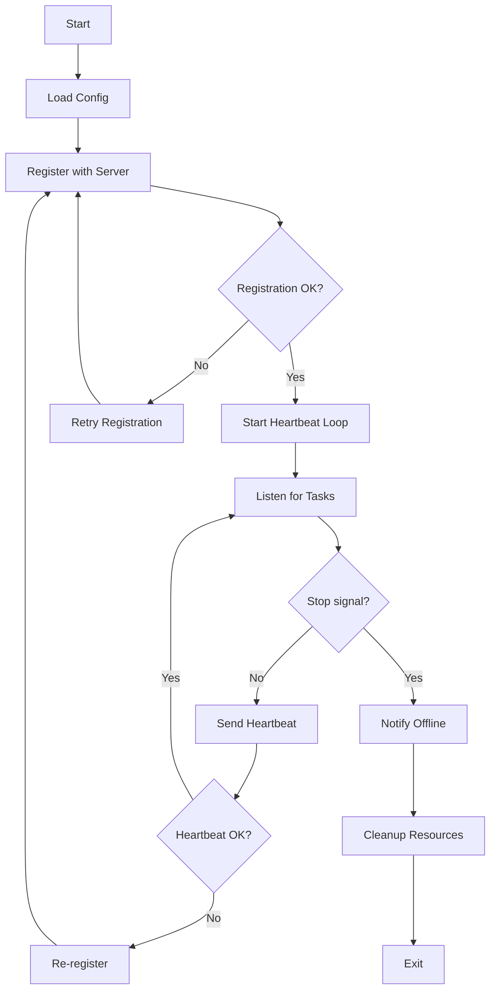
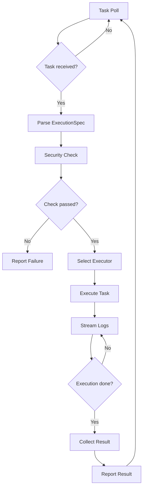
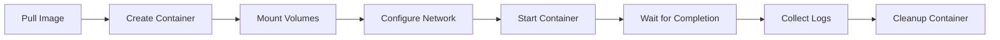
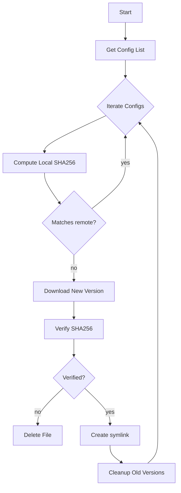

# TestNet Client Architecture Design

---

## I. Architecture Overview

TestNet Client is a lightweight distributed scanning node built with Go, responsible for executing tasks dispatched by the server and reporting results.

### 1.1 Design Goals

- **Lightweight**: Single binary, no external dependencies, fast deployment
- **Cross-platform**: Supports Linux, macOS, and Windows
- **Security Isolation**: Multi-layer security protection against abuse and attacks
- **High Availability**: Auto-reconnect, retry mechanisms, and state recovery
- **Extensible**: Supports multiple executor types, easily extensible

### 1.2 Core Architecture

```
┌─────────────────────────────────────────────────────────────┐
│                     TestNet Client                          │
├─────────────────────────────────────────────────────────────┤
│  ┌─────────────┐  ┌─────────────┐  ┌─────────────┐         │
│  │    node/    │  │    task/    │  │  configfile/│         │
│  │  Lifecycle    │  │  Task Exec    │  │  Config Sync    │         │
│  └──────┬──────┘  └──────┬──────┘  └──────┬──────┘         │
│         │                │                │                 │
│  ┌──────▼────────────────▼────────────────▼──────┐         │
│  │              security/ (Security Policy)               │         │
│  └───────────────────────────────────────────────┘         │
│         │                                                   │
│  ┌──────▼──────┐  ┌─────────────┐  ┌─────────────┐         │
│  │    dsl/     │  │   config/   │  │   logger/   │         │
│  │  DSL Model    │  │   Config Mgmt   │  │    Logger    │         │
│  └─────────────┘  └─────────────┘  └─────────────┘         │
└─────────────────────────────────────────────────────────────┘
                              │
                              ▼
              ┌─────────────────────────────┐
              │     External Executors      │
              ├─────────────────────────────┤
              │ Docker │ Shell │ HTTP │ DNS │ TCP │
              └─────────────────────────────┘
```

---

## II. Core Module Details

### 2.1 Node Lifecycle (node/)

The node lifecycle module handles client registration, heartbeats, and offline management.

#### Directory Structure

```
internal/node/
├── node.go          # Core logic
├── node_test.go     # Unit tests
└── doc.go           # Package docs
```

#### Core Flow



#### Key Implementation

**Registration**:
```go
func (n *Node) Register(ctx context.Context) error {
    req := &RegisterRequest{
        Name:       n.config.Name,
        Labels:     n.config.Labels,
        SystemInfo: n.getSystemInfo(),
    }
    resp, err := n.client.Register(ctx, req)
    if err != nil {
        return err
    }
    n.id = resp.ClientId
    n.token = resp.Token
    return nil
}
```

**Heartbeat**:
```go
func (n *Node) Heartbeat(ctx context.Context) error {
    req := &HeartbeatRequest{
        ClientId:    n.id,
        Status:      n.getStatus(),
        TaskCount:   n.taskManager.GetActiveCount(),
        SystemStats: n.getSystemStats(),
    }
    return n.client.Heartbeat(ctx, req)
}
```

**Offline**:
```go
func (n *Node) Offline(ctx context.Context) error {
    req := &OfflineRequest{ClientId: n.id}
    return n.client.Offline(ctx, req)
}
```

#### Reconnection Mechanism

- Registration failure: exponential backoff retry (1s, 2s, 4s, ... max 30s)
- Heartbeat failure: re-register after 3 consecutive failures
- Network interruption: auto-detect and reconnect

---

### 2.2 Task Execution Engine (task/)

The task execution engine is the core module, responsible for task polling, execution, and result reporting.

#### Directory Structure

```
internal/task/
├── task.go                    # TaskManager core
├── executor.go                # Executor router
├── docker_executor.go         # Docker executor
├── http_executor.go           # HTTP executor
├── dns_executor.go            # DNS executor
├── tcp_executor.go            # TCP executor
├── execution_spec_adapter.go  # ExecutionSpec adapter
├── callback.go                # Task callback
└── *_test.go                  # Test files
```

#### Core Flow



#### TaskManager

```go
type TaskManager struct {
    client       *APIClient
    config       *Config
    executor     *Executor
    activeTasks  map[string]*Task
    semaphore    chan struct{}  // concurrency control
    logger       *zap.Logger
}

func (tm *TaskManager) Poll(ctx context.Context) error {
    for {
        select {
        case <-ctx.Done():
            return ctx.Err()
        default:
            task, err := tm.client.PollTask(ctx, tm.clientID)
            if err != nil {
                tm.logger.Error("poll task failed", zap.Error(err))
                time.Sleep(tm.config.PollInterval)
                continue
            }
            if task != nil {
                go tm.executeTask(ctx, task)
            }
        }
    }
}
```

#### Executor Routing

```go
func (e *Executor) Execute(ctx context.Context, spec *ExecutionSpec) (*Result, error) {
    switch spec.ExecType {
    case "DOCKER":
        return e.dockerExecutor.Execute(ctx, spec)
    case "HTTP":
        return e.httpExecutor.Execute(ctx, spec)
    case "DNS":
        return e.dnsExecutor.Execute(ctx, spec)
    case "TCP":
        return e.tcpExecutor.Execute(ctx, spec)
    case "SHELL":
        return e.shellExecutor.Execute(ctx, spec)
    default:
        return nil, fmt.Errorf("unknown executor type: %s", spec.ExecType)
    }
}
```

---

### 2.3 Docker Executor

The Docker executor is the most commonly used executor, supporting containerized security tool execution.

#### Container Lifecycle



#### Key Implementation

```go
func (e *DockerExecutor) Execute(ctx context.Context, spec *ExecutionSpec) (*Result, error) {
    // 1. Security check
    if err := e.security.ValidateDockerConfig(spec.DockerConfig); err != nil {
        return nil, err
    }

    // 2. Pull image
    if err := e.pullImage(ctx, spec.DockerImage); err != nil {
        return nil, err
    }

    // 3. Create container
    containerID, err := e.createContainer(ctx, spec)
    if err != nil {
        return nil, err
    }
    defer e.removeContainer(ctx, containerID)

    // 4. Start container
    if err := e.client.ContainerStart(ctx, containerID, types.ContainerStartOptions{}); err != nil {
        return nil, err
    }

    // 5. Wait for completion
    statusCh, errCh := e.client.ContainerWait(ctx, containerID, container.WaitConditionNotRunning)
    select {
    case err := <-errCh:
        return nil, err
    case status := <-statusCh:
        // 6. Collect logs
        logs, _ := e.collectLogs(ctx, containerID)
        return &Result{
            ExitCode: status.StatusCode,
            Output:   logs,
        }, nil
    case <-ctx.Done():
        e.client.ContainerKill(ctx, containerID, "SIGTERM")
        return nil, ctx.Err()
    }
}
```

#### Podman Compatibility

The Docker executor also supports Podman, automatically detecting Docker socket or Podman socket:

```go
func getDockerHost() string {
    dockerSocket := "/var/run/docker.sock"
    podmanSocket := "/run/podman/podman.sock"
    
    if _, err := os.Stat(dockerSocket); err == nil {
        return "unix://" + dockerSocket
    }
    if _, err := os.Stat(podmanSocket); err == nil {
        return "unix://" + podmanSocket
    }
    return ""
}
```

---

### 2.4 HTTP Executor

The HTTP executor handles HTTP requests with support for custom methods, headers, and timeout configuration.

#### SSRF Protection

```go
func (e *HTTPExecutor) Execute(ctx context.Context, spec *ExecutionSpec) (*Result, error) {
    // Parse URL
    u, err := url.Parse(spec.HTTPConfig.URL)
    if err != nil {
        return nil, err
    }

    // SSRF check
    if e.security.IsBlockedHost(u.Hostname()) {
        return nil, fmt.Errorf("SSRF blocked: %s", u.Hostname())
    }

    // Re-check IP after DNS resolution
    ips, _ := net.LookupIP(u.Hostname())
    for _, ip := range ips {
        if e.security.IsBlockedIP(ip) {
            return nil, fmt.Errorf("SSRF blocked IP: %s", ip)
        }
    }

    // Execute request
    req, _ := http.NewRequestWithContext(ctx, spec.HTTPConfig.Method, spec.HTTPConfig.URL, nil)
    for k, v := range spec.HTTPConfig.Headers {
        req.Header.Set(k, v)
    }
    
    resp, err := e.client.Do(req)
    if err != nil {
        return nil, err
    }
    defer resp.Body.Close()

    body, _ := io.ReadAll(resp.Body)
    return &Result{
        ExitCode: 0,
        Output:   string(body),
        Metadata: map[string]interface{}{
            "status_code": resp.StatusCode,
            "headers":     resp.Header,
        },
    }, nil
}
```

---

### 2.5 DNS Executor

The DNS executor performs DNS queries and supports multiple record types.

```go
func (e *DNSExecutor) Execute(ctx context.Context, spec *ExecutionSpec) (*Result, error) {
    // SSRF check
    if e.security.IsBlockedDomain(spec.DNSConfig.Domain) {
        return nil, fmt.Errorf("blocked domain: %s", spec.DNSConfig.Domain)
    }

    // Create DNS client
    client := &dns.Client{
        Timeout: time.Duration(spec.TimeoutSeconds) * time.Second,
    }

    // Build query
    msg := new(dns.Msg)
    msg.SetQuestion(dns.Fqdn(spec.DNSConfig.Domain), dns.StringToType[spec.DNSConfig.RecordType])

    // Send query
    nameserver := spec.DNSConfig.Nameserver
    if nameserver == "" {
        nameserver = "8.8.8.8:53"
    }
    
    resp, _, err := client.Exchange(msg, nameserver)
    if err != nil {
        return nil, err
    }

    // Parse results
    var records []string
    for _, ans := range resp.Answer {
        records = append(records, ans.String())
    }

    return &Result{
        ExitCode: 0,
        Output:   strings.Join(records, "\n"),
    }, nil
}
```

---

### 2.6 TCP Executor

The TCP executor is used for port scanning and banner grabbing.

```go
func (e *TCPExecutor) Execute(ctx context.Context, spec *ExecutionSpec) (*Result, error) {
    address := fmt.Sprintf("%s:%d", spec.TCPConfig.Host, spec.TCPConfig.Port)

    // Establish TCP connection
    conn, err := net.DialTimeout("tcp", address, time.Duration(spec.TimeoutSeconds)*time.Second)
    if err != nil {
        return &Result{
            ExitCode: 1,
            Output:   err.Error(),
        }, nil
    }
    defer conn.Close()

    // Banner grabbing
    var banner string
    if spec.TCPConfig.BannerGrab {
        conn.SetReadDeadline(time.Now().Add(time.Duration(spec.TCPConfig.BannerTimeout) * time.Second))
        buf := make([]byte, 1024)
        n, _ := conn.Read(buf)
        banner = string(buf[:n])
    }

    return &Result{
        ExitCode: 0,
        Output:   banner,
        Metadata: map[string]interface{}{
            "address": address,
            "banner":  banner,
        },
    }, nil
}
```

---

### 2.7 Security Policy (security/)

The security policy module provides multi-layer protection mechanisms.

#### Binary Whitelist

```go
var AllowedBinaries = map[string]bool{
    "docker":      true,
    "nmap":        true,
    "masscan":     true,
    "nuclei":      true,
    "subfinder":   true,
    "httpx":       true,
    // ... 80+ whitelisted binaries
}

func (p *Policy) ValidateBinary(binary string) error {
    base := filepath.Base(binary)
    if !AllowedBinaries[base] {
        return fmt.Errorf("binary not in whitelist: %s", base)
    }
    return nil
}
```

#### SSRF Protection

```go
var BlockedIPRanges = []string{
    "10.0.0.0/8",
    "172.16.0.0/12",
    "192.168.0.0/16",
    "127.0.0.0/8",
    "169.254.0.0/16",
    "0.0.0.0/8",
}

func (p *Policy) IsBlockedIP(ip net.IP) bool {
    for _, cidr := range BlockedIPRanges {
        _, network, _ := net.ParseCIDR(cidr)
        if network.Contains(ip) {
            return true
        }
    }
    return false
}

func (p *Policy) IsBlockedHost(host string) bool {
    blocked := []string{"localhost", "127.0.0.1", "0.0.0.0", "::1"}
    for _, b := range blocked {
        if host == b {
            return true
        }
    }
    return false
}
```

#### Volume Mount Restrictions

```go
var AllowedMountPaths = []string{
    "/tmp",
    "/var/tmp",
}

var MaxVolumeSize int64 = 100 * 1024 * 1024 // 100MB

func (p *Policy) ValidateVolume(hostPath string) error {
    // Path check
    allowed := false
    for _, prefix := range AllowedMountPaths {
        if strings.HasPrefix(hostPath, prefix) {
            allowed = true
            break
        }
    }
    if !allowed {
        return fmt.Errorf("volume path not allowed: %s", hostPath)
    }

    // Size check
    var stat syscall.Statfs_t
    if err := syscall.Statfs(hostPath, &stat); err == nil {
        available := stat.Bavail * uint64(stat.Bsize)
        if available > uint64(MaxVolumeSize) {
            return fmt.Errorf("volume size exceeds limit: %s", hostPath)
        }
    }

    return nil
}
```

---

### 2.8 Config File Sync (configfile/)

The config file sync module handles synchronization and version management of remote configuration files.

#### Sync Flow



#### Version Management

Version management uses symlinks:

```
/var/lib/testnet/configs/
├── subfinder/
│   ├── config.yaml.v1
│   ├── config.yaml.v2
│   └── config.yaml -> config.yaml.v2
```

```go
func (m *Manager) updateSymlink(configID, version string) error {
    dir := m.getConfigDir(configID)
    target := filepath.Join(dir, fmt.Sprintf("%s.v%s", m.filename, version))
    link := filepath.Join(dir, m.filename)

    // Atomically update symlink
    tempLink := link + ".tmp"
    if err := os.Symlink(target, tempLink); err != nil {
        return err
    }
    return os.Rename(tempLink, link)
}
```

---

## III. Data Models

### 3.1 ExecutionSpec

ExecutionSpec is the execution specification dispatched from the server to the client.

```go
type ExecutionSpec struct {
    ExecType        string                 `json:"execType"`
    DockerImage     string                 `json:"dockerImage,omitempty"`
    Command         string                 `json:"command,omitempty"`
    Args            []string               `json:"args,omitempty"`
    Timeout         int                    `json:"timeout"`
    WorkDir         string                 `json:"workDir,omitempty"`
    Env             map[string]string      `json:"env,omitempty"`
    DockerConfig    *DockerConfig          `json:"dockerConfig,omitempty"`
    HTTPConfig      *HTTPConfig            `json:"httpConfig,omitempty"`
    DNSConfig       *DNSConfig             `json:"dnsConfig,omitempty"`
    TCPConfig       *TCPConfig             `json:"tcpConfig,omitempty"`
    Files           []FileSpec             `json:"files,omitempty"`
    CleanupFiles    []string               `json:"cleanupFiles,omitempty"`
    ConfigFiles     []ConfigFileUsage      `json:"configFiles,omitempty"`
    InputAssetType  string                 `json:"inputAssetType,omitempty"`
    OutputAssetType string                 `json:"outputAssetType,omitempty"`
    SourceAssetID   string                 `json:"sourceAssetId,omitempty"`
}
```

### 3.2 Task Status

```go
type TaskStatus string

const (
    TaskStatusPending   TaskStatus = "PENDING"
    TaskStatusAssigned  TaskStatus = "ASSIGNED"
    TaskStatusRunning   TaskStatus = "RUNNING"
    TaskStatusCompleted TaskStatus = "COMPLETED"
    TaskStatusFailed    TaskStatus = "FAILED"
)
```

---

## IV. Performance Optimization

### 4.1 Concurrency Control

Using a semaphore to control maximum concurrent task count:

```go
type TaskManager struct {
    semaphore chan struct{}
}

func (tm *TaskManager) executeTask(ctx context.Context, task *Task) {
    // Acquire semaphore
    tm.semaphore <- struct{}{}
    defer func() { <-tm.semaphore }()

    // Execute task
    result, err := tm.executor.Execute(ctx, task.ExecutionSpec)
    // ...
}
```

### 4.2 Long Polling

Task polling uses HTTP long-polling to reduce network overhead. The current Go client does not rely on WebSocket for task pulling; the server WebSocket is primarily used for frontend notifications and task status display.

```go
func (c *APIClient) PollTask(ctx context.Context, clientID string) (*Task, error) {
    req := &PollRequest{
        ClientId:  clientID,
        Timeout:   30, // 30-second long poll
    }
    return c.pollTaskWithRetry(ctx, req, 3)
}
```

### 4.3 Batched Log Reporting

Task logs use a batched reporting strategy:

```go
type LogBuffer struct {
    buffer   []LogEntry
    maxItems int
    maxWait  time.Duration
    client   *APIClient
}

func (lb *LogBuffer) Add(entry LogEntry) {
    lb.buffer = append(lb.buffer, entry)
    if len(lb.buffer) >= lb.maxItems {
        lb.Flush()
    }
}

func (lb *LogBuffer) Flush() error {
    if len(lb.buffer) == 0 {
        return nil
    }
    err := lb.client.UploadLogs(lb.buffer)
    lb.buffer = lb.buffer[:0]
    return err
}
```

---

## V. Monitoring & Debugging

### 5.1 Health Check

The client provides an optional health check endpoint:

```go
func (n *Node) HealthCheck() map[string]interface{} {
    return map[string]interface{}{
        "status":       "healthy",
        "node_id":      n.id,
        "active_tasks": n.taskManager.GetActiveCount(),
        "uptime":       time.Since(n.startTime).Seconds(),
        "system":       n.getSystemStats(),
    }
}
```

### 5.2 Log Level

Supports dynamic log level adjustment:

```go
func SetLogLevel(level string) {
    var zapLevel zapcore.Level
    switch level {
    case "debug":
        zapLevel = zapcore.DebugLevel
    case "info":
        zapLevel = zapcore.InfoLevel
    case "warn":
        zapLevel = zapcore.WarnLevel
    case "error":
        zapLevel = zapcore.ErrorLevel
    }
    logger.SetLevel(zapLevel)
}
```

### 5.3 Performance Metrics

Key performance metrics:
- Task execution success rate
- Average execution time
- Concurrent task count
- Memory usage
- CPU usage

---

## VI. Troubleshooting

### 6.1 Common Issues

| Issue | Possible Cause | Solution |
|------|----------|----------|
| Cannot connect to server | Network issue, wrong secret | Check network, verify secret |
| Docker task fails | Image not found, permission issue | Pull image, check permissions |
| Task timeout | Slow network, target unreachable | Increase timeout |
| SSRF blocked | Accessing internal IP | Verify target address is legitimate |

### 6.2 Debug Commands

```bash
# View logs
./testnet-client -verbose

# Test execution
./testnet-client test --spec spec.yaml --mock mock.yaml

# Validate DSL
./testnet-client validate --spec spec.yaml

# View machine ID
./testnet-license show-machine-id
```

---

## Related Documentation

- [Scanning Node Management](/en/client/overview) - Node deployment and management
- [System Setup & Activation Guide](/en/deploy/overview) - Complete service installation and cluster deployment guide
- [DSL Reference](/en/workflow/dsl-reference) - vNext DSL detailed specification
