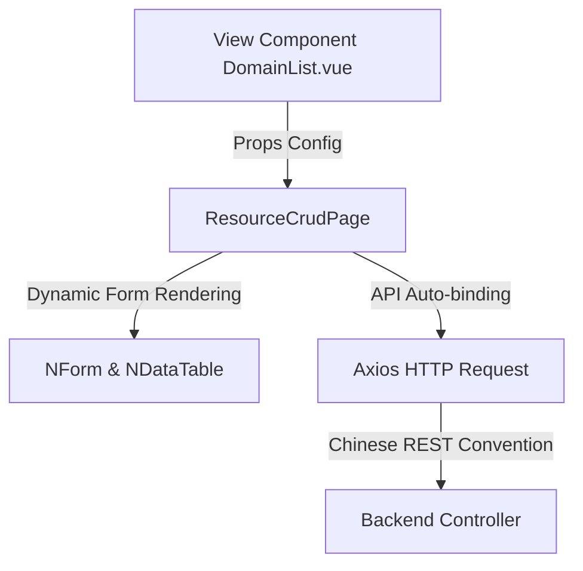

# Frontend CRUD Page Skeleton Developer Guide

`ResourceCrudPage.vue` (located at `src/components/ResourceCrudPage.vue`) is the core reusable component in the TestNet frontend project. All 8 asset management modules, project management, role permissions, user configuration, and over a dozen other pages are built on this component. It provides standardized data listing, form entry, paginated filtering, Excel import/export, custom columns, and batch operations.

## Core Design Principles

`ResourceCrudPage` follows **declarative configuration-driven** and **Chinese REST convention-adapted** design principles:



By passing a specific `endpoint` route and configuration parameters, the component automatically binds to backend Chinese REST endpoints, automatically renders lists and CRUD forms, thereby avoiding large amounts of redundant code.

## Component API (Props) Reference

```typescript
const props = defineProps<{
  title: string                          // Page title, supports custom i18n auto-translation
  description?: string                   // Page description
  endpoint: string                       // Bound API prefix route, e.g. '/domain', '/api/v1/project'
  columns: DataTableColumns<any>         // Naive UI table column config (no need to include action/selection columns)
  formFields: FormField[]                // CRUD modal form field configuration
  initialValues: Record<string, any>     // Default initial values for form fields
  searchPlaceholder?: string             // Fuzzy search box placeholder (default: Enter keyword to search)
  searchParam?: string                   // Fuzzy search query parameter name (default: 'q')
  rowActions?: RowAction[]               // Extra inline or dropdown action buttons (first two inline, rest in "more")
  fixedQuery?: Record<string, any>       // Fixed list query parameters (e.g. specific asset category filter)
  fixedPayload?: Record<string, any>     // Fixed form submission payload fields
  importConfig?: {                       // Excel import/export config
    typeName: string                     // Asset import type name (e.g. domain)
    importUrl: string                    // Import file endpoint
    exportUrl: string                    // Export Excel endpoint
  }
  assetType?: string                     // Asset type identifier (e.g. 'DOMAIN'), enables change history drawer
  statusType?: 'asset' | 'user'          // Status change mapping rule
  stats?: (rows: any[], total: number) => StatItem[] // Top stats panel calculation callback
  onEditOpened?: (id: string, formModel: Record<string, any>) => Promise<void> // Hook when edit modal opens
  customRules?: Record<string, FormRule | FormRule[]> // Custom form validation rules
  customRenderers?: Record<string, (value: any, onUpdate: (v: any) => void) => any> // Custom form field renderers
  transformPayload?: (payload: Record<string, any>) => Record<string, any> // Payload transform interceptor before submit
  batchAddConfig?: {                     // Enable textarea batch add (e.g. enter multiple domains at once)
    identifier: string                   // Batch add core field (e.g. 'domains')
    label: string                        // Input box Label
    placeholder?: string
  }
  hideAdd?: boolean                      // Hide "Add" button
  hideEdit?: boolean                     // Hide inline "Edit" button
  skipProjectFilter?: boolean            // Skip project context isolation filter
  refreshOnSave?: boolean                // Refresh project & asset options cache after save
  defaultHiddenColumns?: string[]        // Default hidden table columns
}>()
```

::: tip Path Alias
The frontend path alias `@` maps to `src/` (configured in `vite.config.ts` and `tsconfig.app.json`).
:::

## Key Data Structure Configuration

### 1. Form Field Definition (`FormField`)

`FormField` declares how form items are rendered in the modal:

```typescript
export interface FormField {
  key: string                           // Form data binding key
  label: string                         // Form item label
  type?: FieldType                      // Field input type (see below)
  placeholder?: string                  // Input hint
  options?: any[] | { value: any[] }    // Dropdown data source (supports ref dynamic linkage)
  multiple?: boolean                    // Allow multi-select in dropdown
  required?: boolean                    // Is required field
  span?: number                         // Grid column span (default 24, full row)
  disabled?: boolean                    // Disable input
  filterable?: boolean                  // Allow search/filter in dropdown
  labelField?: string                   // Custom dropdown option label field name
  keyField?: string                     // Custom dropdown option value field name
  childrenField?: string                // Tree dropdown children field name
  min?: number                          // Minimum constraint (for number or string length)
  max?: number                          // Maximum constraint
  extra?: string                        // Gray hint text below form item
}
```

**Supported `FieldType`**:
- `input`: Standard single-line text input
- `textarea`: Multi-line text input
- `number`: Number stepper
- `select`: Single/multi-select dropdown
- `tree-select`: Tree selector (for department selection etc.)
- `color`: Color picker
- `datetime`: Date-time picker
- `checkbox`: Checkbox
- `switch`: Switch toggle
- `radio`: Radio button

## Slots Extension Mechanism

`ResourceCrudPage` provides multiple scoped slots, allowing developers to render custom content in specific parts of the page without modifying the component source code:

```vue
<!-- 1. header-actions: Top action bar slot (after "Add", "Delete" buttons) -->
<template #header-actions>
  <n-button type="info" @click="handleBatchExport">Custom Batch Export</n-button>
</template>

<!-- 2. search-bar: Custom search area slot (overrides default simple search box) -->
<template #search-bar="{ keyword, onSearch }">
  <custom-filter-panel v-model:keyword="keyword" @search="onSearch" />
</template>

<!-- 3. stats: Top data summary slot (overrides SummaryStatsGrid) -->
<template #stats>
  <custom-dashboard-banner />
</template>

<!-- 4. form-item-{key}: Custom form item rendering (when FormField type is insufficient, override rendering for specified key) -->
<template #form-item-password="{ model, field }">
  <n-input v-model:value="model.password" type="password" show-password-on="click" />
</template>
```

## Integrated Composables

The component internally depends on and integrates deeply with the following Vue Composables:

1. **`useColumnPreferences`** (located at `src/composables/useColumnPreferences.ts`)
   - **Function**: Manage table column visibility and width ordering.
   - **Mechanism**: After each user click on "Column Settings" to toggle visibility or reorder columns, the state is automatically synced to LocalStorage (Key format: `testnet:table-columns:{endpoint}`), achieving persistent personalized configuration.

2. **`useAssetOptions`** (located at `src/composables/useAssetOptions.ts`)
   - **Function**: Cache and manage global asset-related option data (e.g. domain lists, company lists, etc. for cross-page shared dropdown options).

## Typical Integration Example (`DomainList.vue`)

Below shows how to introduce and use the component in an actual page to configure a domain asset management interface:

```vue
<template>
  <ResourceCrudPage
    title="Domain Management"
    endpoint="/api/v1/asset/domain"
    asset-type="DOMAIN"
    :columns="columns"
    :form-fields="formFields"
    :initial-values="initialValues"
    :import-config="importConfig"
  />
</template>

<script setup lang="ts">
import { h } from 'vue'
import { NTag } from 'naive-ui'
import ResourceCrudPage from '@/components/ResourceCrudPage.vue'
import { useAssetOptions } from '@/composables/useAssetOptions'

const { companyOptions } = useAssetOptions()

const columns = [
  { title: 'Domain', key: 'domainName', sorter: 'default' },
  {
    title: 'Company',
    key: 'companyName',
    render: (row: any) => h(NTag, { type: 'info' }, { default: () => row.companyName || 'N/A' })
  },
  { title: 'Created', key: 'createTime', width: 180 }
]

const formFields = [
  { key: 'domainName', label: 'Domain', type: 'input', required: true },
  {
    key: 'companyId',
    label: 'Company',
    type: 'select',
    options: companyOptions,
    required: true
  },
  { key: 'description', label: 'Notes', type: 'textarea' }
]

const initialValues = {
  domainName: '',
  companyId: null,
  description: ''
}

const importConfig = {
  typeName: 'domain',
  importUrl: '/api/v1/asset/domain/import',
  exportUrl: '/api/v1/asset/domain/export'
}
</script>
```

::: warning Component Size
`ResourceCrudPage.vue` is approximately 1332 LOC, the most critical reusable component in the frontend. Modifications must be done carefully to ensure all dependent pages are not affected.
:::
